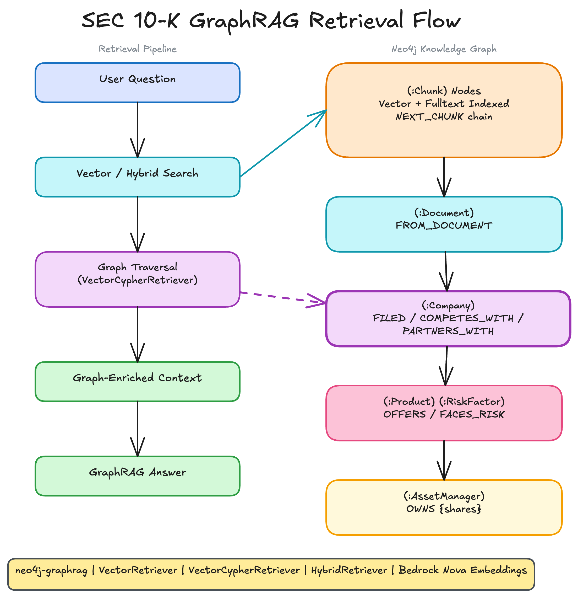

# sample-graphrag

Build a knowledge graph from an SEC filing and query it with progressively richer retrieval strategies, from basic vector search to full GraphRAG question answering.

This project uses the [neo4j-graphrag-python](https://github.com/neo4j/neo4j-graphrag-python) library, OpenAI for LLM and embeddings, and Neo4j for graph storage. Six scripts walk through progressively richer GraphRAG retrieval and question-answering patterns.

The tutorial scripts are followed by a staged production-candidate roadmap in
[`AGENTS.md`](AGENTS.md). Its measurable scope and quality gates are defined in
[`docs/acceptance_contract.md`](docs/acceptance_contract.md).

Local validation defaults to the resource-bounded `dev-mini` profile (100
Chunks and two retrieval clients). The full production-scale values remain in
`contracts/acceptance.v1.json` and can be resolved and checked with
`python3 scripts/validate_acceptance_contract.py --profile production-reference`.
A `dev-mini` result exercises the complete workflow but is not production
qualification evidence.

The profile command validates and previews the declared workload; it does not
run a load test. Stage 5A materializes the bounded development corpus described
below, while Stage 8/9 will make a unified evaluation runner consume the
declared corpus, concurrency, sample, and duration values. Disposable Neo4j
runners enforce the checked local resource cap.

Stage 5A adds a separate, versioned `dev-corpus-v1`: 10 deterministic
synthetic filings across two tenants and five company identities, with 120
exact Chunks and all seven question classes. It complements rather than
replaces the one-file teaching sample. Its construction, provenance boundary,
checks, and limitations are documented in
[`docs/representative_dev_corpus.md`](docs/representative_dev_corpus.md), with
the repeatable evidence recorded in
[`docs/validation/stage-5a.md`](docs/validation/stage-5a.md).

The production implementation is developed separately under
`src/graphrag_prod`. Its stable identity, source provenance, access boundary,
and Neo4j model are documented in
[`docs/provenance_model.md`](docs/provenance_model.md); completed stage evidence
is recorded under [`docs/validation`](docs/validation). The resumable provider,
snapshot publication, deletion, and vector-generation lifecycle is documented
in [`docs/incremental_ingestion.md`](docs/incremental_ingestion.md). Versioned
graph schema rules, conservative entity resolution, quarantine, and quality
reports are documented in
[`docs/graph_quality_governance.md`](docs/graph_quality_governance.md).

## Prerequisites

- **Python 3.12+**
- **An OpenAI API key** with access to `gpt-5-mini` and `text-embedding-3-small`
- **A Neo4j instance with APOC Core** -- either a local install or the free [Neo4j Aura](https://neo4j.com/cloud/aura-free/) tier

## Setting Up uv

[uv](https://docs.astral.sh/uv/) is a fast Python package manager that replaces pip, venv, and pip-tools. If you haven't used it before:

```bash
# Install uv
curl -LsSf https://astral.sh/uv/install.sh | sh

# Or with Homebrew on macOS
brew install uv
```

Once installed, `uv sync` reads `pyproject.toml`, creates a `.venv`, and installs all dependencies in one step. Run any project script with `uv run python <script>` -- it automatically activates the virtual environment.

This project depends on just two packages:

- `neo4j-graphrag[openai]` -- the official Neo4j GraphRAG library with OpenAI integration
- `python-dotenv` -- loads credentials from `.env`

## Setting Up Neo4j

You need a running Neo4j instance. Two options:

**Option A: Neo4j Aura (cloud, free tier)**

1. Go to [neo4j.com/cloud/aura-free](https://neo4j.com/cloud/aura-free/) and create a free instance
2. Copy the connection URI (starts with `neo4j+s://`) and password
3. Put them in your `.env` file

**Option B: Local Neo4j (Docker)**

```bash
docker run -d --name neo4j \
  --memory 1536m --memory-swap 1536m --cpus 1 \
  -p 7474:7474 -p 7687:7687 \
  -e NEO4J_AUTH=neo4j/your-password-here \
  -e NEO4J_server_memory_heap_initial__size=256m \
  -e NEO4J_server_memory_heap_max__size=512m \
  -e NEO4J_server_memory_pagecache_size=128m \
  -e 'NEO4J_PLUGINS=["apoc"]' \
  neo4j:5.26.12-community
```

Then set `NEO4J_URI=neo4j://localhost:7687` in your `.env`. APOC Core is
required for dynamic relationship creation and entity resolution.
These local limits match the default `dev-mini` profile; they cap Neo4j at
1.5 GiB and one CPU without changing the graph schema or code paths.

## Quick Start

Once you have Python, uv, an OpenAI key, and a Neo4j instance ready:

```bash
git clone <this-repo> && cd sample-graphrag

# 1. Install dependencies
uv sync

# 2. Configure credentials
cp .env.example .env
# Edit .env with your OPENAI_API_KEY, NEO4J_URI, NEO4J_PASSWORD

# 3. Run the pipeline
uv run python src/01_build_knowledge_graph.py
uv run python src/02_vector_retriever.py
uv run python src/03_vector_cypher_retriever.py
uv run python src/04_hybrid_cypher_retriever.py
uv run python src/05_graphrag_qa.py
uv run python src/06_graph_expanded_rag.py
```

## How GraphRAG Works

The diagram below shows the full retrieval flow this project implements:



**Left side -- Retrieval Pipeline:** A user question is embedded and matched against chunk vectors (and optionally fulltext keywords). The `VectorCypherRetriever` then traverses the graph from matched chunks to related entities, building graph-enriched context. That context feeds the LLM to produce a grounded answer.

**Right side -- Neo4j Knowledge Graph:** The graph has two layers. The *lexical layer* consists of `Chunk` nodes (with vector and fulltext indexes) linked to their parent `Document` via `FROM_DOCUMENT`. The *semantic layer* consists of extracted entities -- `Company`, `Product`, `RiskFactor` -- connected by typed relationships like `OFFERS` and `FACES_RISK`. Entities link back to the chunks they were extracted from via `FROM_CHUNK`.

The key insight: when a chunk matches a query by vector similarity, traversing to its linked entities surfaces structured facts that the embedding alone cannot capture. A question about "risk factors" returns not just the relevant text but also named `RiskFactor` entities and the `Company` they belong to.

---

## Tutorial Walkthrough

### Step 1: Build the Knowledge Graph

```bash
uv run python src/01_build_knowledge_graph.py
```

This script takes an Apple 10-K SEC filing excerpt (`data/apple_10k_excerpt.txt`) and transforms it into a queryable knowledge graph using `SimpleKGPipeline`.

**What happens under the hood:**

1. **Text splitting** -- The filing is split into ~500-character chunks with 100-character overlap, using `FixedSizeSplitter`. Smaller chunks ensure that different queries match different sections of the filing.

2. **Embedding** -- Each chunk is embedded with `text-embedding-3-small` (1536 dimensions) and stored on the `Chunk` node.

3. **Entity extraction** -- The LLM (`gpt-5-mini`) reads each chunk and extracts entities according to a schema you define:

   ```python
   NODE_TYPES = [
       {"label": "Company", "properties": [{"name": "ticker", "type": "STRING"}]},
       {"label": "Product", "description": "A product or service offered by a company", ...},
       {"label": "RiskFactor", "description": "A business risk faced by a company", ...},
   ]

   PATTERNS = [
       ("Company", "OFFERS", "Product"),
       ("Company", "FACES_RISK", "RiskFactor"),
   ]
   ```

   The schema tells the LLM *what* to look for. Without it, extraction produces noisy, inconsistent results. With it, you get a clean graph with typed entities and relationships.

4. **Entity resolution** -- `SimpleKGPipeline` merges entities with the same label and name, preventing duplicates like "Apple" and "Apple Inc." from cluttering the graph.

5. **Index creation** -- A vector index (`chunkEmbeddings`) for semantic search and a fulltext index (`chunkFulltext`) for keyword search are created on the `Chunk` nodes.

**Expected output:**

```
=== Nodes ===
  Chunk: 8
  Company: 1
  Document: 1
  Product: 30
  RiskFactor: 13

=== Relationships ===
  FROM_CHUNK: 46
  FROM_DOCUMENT: 8
  NEXT_CHUNK: 7
  OFFERS: 14
```

You now have a two-layer knowledge graph: 8 text chunks linked to 1 document, with 44 extracted entities and their relationships.

---

### Step 2: Vector Retriever (Baseline)

```bash
uv run python src/02_vector_retriever.py
```

The simplest retrieval pattern. `VectorRetriever` embeds your query and finds the most similar chunks by cosine distance:

```python
retriever = VectorRetriever(
    driver=driver,
    index_name=VECTOR_INDEX_NAME,
    embedder=embedder,
)
results = retriever.search(query_text="What products does Apple sell?", top_k=3)
```

Each result is a chunk with a similarity score. The "products" query returns the product-description chunk (score ~0.83), the wearables/services chunk (score ~0.80), and the iPhone/Mac chunk (score ~0.80).

**What you see:** Raw text chunks ranked by semantic similarity. No graph structure, no entity names -- just the text that was embedded.

**What's missing:** If you ask "What are the key risk factors?", you get back text chunks, but nothing tells you that the graph contains 13 named `RiskFactor` entities linked to a `Company` node. That's what the next step adds.

---

### Step 3: Vector Cypher Retriever (Graph-Enriched)

```bash
uv run python src/03_vector_cypher_retriever.py
```

`VectorCypherRetriever` does the same vector search as step 2, then executes a Cypher query to traverse from matched chunks into the surrounding graph:

```python
RETRIEVAL_QUERY = """
WITH node AS chunk, score
OPTIONAL MATCH (chunk)-[:FROM_DOCUMENT]->(doc:Document)
OPTIONAL MATCH (entity)-[:FROM_CHUNK]->(chunk)
...
RETURN chunk.text AS text, score, doc.source AS source, entities
"""
```

For each matched chunk, the query collects:
- The parent **Document** (via `FROM_DOCUMENT`)
- All **entities** extracted from that chunk (via `FROM_CHUNK`), with their labels and names

**What changes:** Results now include lines like:

```
Related entities: Product: iPad, Product: Apple Watch, Product: AirPods,
                  Product: HomePod, Product: Beats, Product: AppleCare, ...
Source: SEC EDGAR
```

The risk factors query surfaces `RiskFactor: Inflation`, `RiskFactor: Supply chain disruptions`, and other named entities alongside the text. This is the graph enrichment -- structured facts that vector similarity alone cannot surface.

A custom `formatter` function shapes each Neo4j record into a `RetrieverResultItem`, controlling exactly what the downstream LLM sees.

---

### Step 4: Hybrid Cypher Retriever

```bash
uv run python src/04_hybrid_cypher_retriever.py
```

`HybridCypherRetriever` combines two search strategies before traversing the graph:

- **Vector search** -- semantic similarity over embeddings (catches paraphrases and conceptual matches)
- **Fulltext search** -- keyword matching over chunk text (catches exact terms like "iPhone" or "$391.0 billion")

```python
retriever = HybridCypherRetriever(
    driver=driver,
    vector_index_name=VECTOR_INDEX_NAME,
    fulltext_index_name=FULLTEXT_INDEX_NAME,
    retrieval_query=RETRIEVAL_QUERY,
    result_formatter=formatter,
    embedder=embedder,
)
```

The scores are fused (notice results at 1.0000 vs the ~0.83 from pure vector search). Hybrid retrieval is more robust for production use -- vector search handles semantic variation while fulltext search ensures exact keyword matches aren't missed.

---

### Step 5: GraphRAG Question Answering

```bash
uv run python src/05_graphrag_qa.py
```

The final step composes a retriever with an LLM to answer natural language questions:

```python
rag = GraphRAG(retriever=retriever, llm=llm)

result = rag.search(
    query_text="What products and services does Apple offer?",
    return_context=True,
)
print(result.answer)
```

`GraphRAG` takes the graph-enriched context from the retriever and feeds it to the LLM as grounding material. The LLM generates an answer that cites specific facts from the knowledge graph rather than relying on its training data.

Four sample questions demonstrate the system end to end:

| Question | What the graph adds |
|---|---|
| "What products and services does Apple offer?" | Named `Product` entities from multiple chunks |
| "What are the main risk factors?" | Named `RiskFactor` entities with descriptions |
| "Summarize Apple's financial performance in FY2024." | Financial data chunks with `Product: iPhone`, `Product: Services` context |
| "What is Apple's fastest growing business segment?" | Retrieves the specific chunk with 13% growth figure |

Setting `return_context=True` lets you inspect exactly what the LLM was given, making the full pipeline transparent.

---

## Production reference implementation

The numbered examples remain learning artifacts. Production-oriented packages
under `src/graphrag_prod/` now cover provenance, incremental ingestion, graph
governance, and bounded retrieval. Stage 5 retrieval uses stable IDs, active
versions, tenant and access-group filters on every path, standard RRF and RA,
whole-Chunk context budgets, exact citations, and a structured trace.

See `docs/production_retrieval.md` for the retrieval design and
`docs/validation/stage-5.md` for repeatable validation evidence.

---

## Project Structure

```
sample-graphrag/
    pyproject.toml                      # Dependencies
    .env.example                        # Credential template
    graph-enriched-retrieval.png        # Architecture diagram
    data/
        apple_10k_excerpt.txt           # Sample Apple 10-K filing
    src/
        config.py                       # Driver, LLM, embedder, index names
        shared.py                       # Retrieval query and formatter
        01_build_knowledge_graph.py     # Text -> knowledge graph
        02_vector_retriever.py          # Pure vector search
        03_vector_cypher_retriever.py   # Vector + graph traversal
        04_hybrid_cypher_retriever.py   # Hybrid + graph traversal
        05_graphrag_qa.py               # Full RAG question answering
        06_graph_expanded_rag.py         # RRF + RA graph-expanded RAG
```

## Key Concepts

| Concept | Where it appears | Why it matters |
|---|---|---|
| **Schema-guided extraction** | `01_build_knowledge_graph.py` | Tells the LLM what entities and relationships to look for, producing a clean, typed graph |
| **Two-layer graph** | Neo4j after step 1 | Lexical layer (chunks) for retrieval, semantic layer (entities) for structured context |
| **Entity resolution** | `SimpleKGPipeline` | Merges duplicate entities automatically |
| **Vector index** | `chunkEmbeddings` | Enables semantic similarity search over chunk embeddings |
| **Fulltext index** | `chunkFulltext` | Enables keyword search, complements vector search |
| **Graph traversal** | `RETRIEVAL_QUERY` in `shared.py` | Walks from matched chunks to related entities via Cypher |
| **Hybrid retrieval** | `HybridCypherRetriever` | Fuses vector + fulltext scores for more robust matching |
| **Grounded generation** | `GraphRAG` | LLM answers are based on retrieved graph context, not training data |
