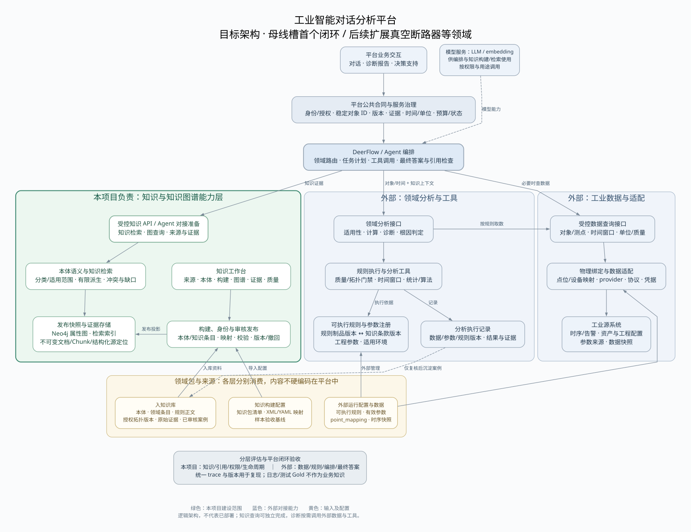
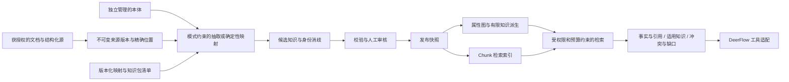

# 工业智能对话分析平台：目标架构与知识库边界

设计日期：2026-09-13。状态：架构设计基线，待分阶段实现与联调。

本文依据用户确认的平台背景、当前知识库代码和用户授权的 `new_files/` 编制。它明确平台全貌及本仓库的责任，不代表 DeerFlow 已接入、母线槽包已发布、诊断引擎已实现，或 8002 已通过新的业务验收。本次只更新设计文档与开发约定，不修改运行服务、原始知识文件和数据库。

## 1. 平台目标与架构图

长期建设面向施耐德电气工业场景的智能对话分析平台，统一连接工业知识、设备数据、分析工具和 Agent 编排，提供问答、诊断、根因分析与决策支持。母线槽是首个垂直领域和架构验证载体，后续接入真空断路器等设备。

本项目建设可复用的知识与知识图谱能力层。平台采用 DeerFlow 编排任务，通过有版本、可授权、可验证的接口调用知识、数据和领域分析服务。完整平台不是本仓库的开发任务。

[查看高清 PNG](architecture/platform-overview.png) · [查看矢量 SVG](architecture/platform-overview.svg) · [Graphviz 可编辑源文件](architecture/platform-overview.dot)

图中绿色区域是本项目；蓝色区域是外部平台能力；黄色区域是各责任层消费的输入。箭头表达调用、依赖或资料流向，响应沿调用返回，不代表所有资料都写入知识库。图中的服务是逻辑责任边界，不要求全部拆成独立微服务。

平台采用 DeerFlow 的编排定位，与其官方对工具、子任务和运行上下文的定位相符；具体身份、合同与工业工具仍需本平台集成，不是框架自动提供。[DeerFlow 官方仓库](https://github.com/bytedance/deer-flow)

## 2. 谁负责什么

| 能力 | 主责层 | 本项目应完成的部分 | 本项目不承担的部分 |
| --- | --- | --- | --- |
| 对话、意图澄清、任务计划、领域路由 | 平台交互层、DeerFlow | 返回可解释的知识与缺口 | 重新开发完整 Agent 编排器、跨工具会话记忆 |
| 来源、本体、领域概念、工程知识 | 知识库 | 摄取、校验、身份、审核、发布、版本、撤回、证据定位 | 以知识图谱静默替代工程源系统 |
| 拓扑与测点语义 | 工程源系统是来源；知识库管理发布投影 | 解析受信拓扑快照、稳定对象 ID、有限图查询、语义测点与来源关联 | 采集设备、通信协议、实时连接和原始数据存储 |
| 类别与有限知识派生 | 知识库 | 明确分类、受支持的路径/范围派生、前提与派生版本追溯 | 无条件复制同类实例关系、实时故障判定 |
| 规则知识 | 领域专家与知识库 | 保存规则正文、条款、适用条件、所需参数、概念关系和发布版本 | 把 Markdown 直接当已部署的计算程序 |
| 规则执行、特征计算、诊断和根因判定 | 领域分析层 | 提供规则依据、对象与范围、知识证据 | 时间窗口计算、生产阈值校准、时序判据引擎、根因算法 |
| 工程参数与物理点位绑定 | 参数注册与数据适配层 | 参数语义、单位、绑定标识及授权快照引用 | 物理地址、访问凭据、数据提供者管理、权威运行参数注册 |
| 最终综合回答与建议 | DeerFlow、平台答案验证 | 提供可引用事实、冲突、知识不足信息 | 自称已验证其他工具的计算；绕过诊断结果补猜根因 |
| 用户界面 | 平台业务 UI；本项目知识工作台 | 来源、本体、构建、图谱、证据与治理界面 | 整个平台告警台、诊断报告、跨任务用户旅程 |
| 评估 | 各层分别验收，平台负责端到端 | 知识质量、身份、检索、引用、权限、版本生命周期 | 用知识检索测试替代诊断准确率和完整场景验收 |
| 案例沉淀 | 分析记录系统、领域复核、知识库 | 对已复核案例登记来源、审核和发布 | 自动把聊天、工具输出或模型假设升级为已确认知识 |

现有 `/v1/answers` 可保留为库内有依据问答和验证入口。平台默认取知识证据，再由 DeerFlow 结合外部工具结果组织最终回答；若选择调用库内答案，须携带其逐项事实与引用，不能把一段二次摘要当作原始证据。

## 3. 知识库内部应该建设的链路

- 原文与结构化源均保留不可变版本。XML/YAML 关系应能定位到源文件版本、XML 路径或 YAML 键路径及精确文本范围，并与当前 Chunk 证据契约衔接；不能只保存一条无出处的边。
- Neo4j 保存受治理的图谱投影及关联证据。原文归档和检索索引遵守同一发布边界；不要求为此另建一种向量数据库。
- 本体管理类型、属性、关系、分类及受支持的派生语义；知识条目提供具体概念和陈述。知识包清单装配文件，映射配置适配来源。固定实例数量与特定测试案例属于验收基线。
- 有限派生只执行明确、版本化、受支持的操作；未知操作拒绝或报告不支持，不把任意 YAML 表达式作为代码执行。不承诺所有未来诊断算法都能仅改配置接入。
- 派生结果保留前提、规则/映射版本与来源。发布、规则或证据撤回时，结果必须失效或重算，不能脱离原证据长期残留。
- 类别模板、实例事实、派生关系和候选原因分别表达；来源等级、形成方式和审核状态是独立维度。图谱展示不能把“应该有测点”画成“已安装测点”，也不能把“可能原因”画成已发生故障。

这种结构化检索与图遍历的组合可参考 Neo4j 的 RAG 文档；类别查询和层级推理有 Neo4j Labs 的文档化实现，但本项目并未因此自动获得完整 OWL 推理或 n10s 能力。[Neo4j RAG](https://neo4j.com/docs/neo4j-graphrag-python/current/user_guide_rag.html)、[Neo4j Labs 分类推理](https://neo4j.com/labs/neosemantics/5.14/inference/)

## 4. 输入文件的归属与取舍

“保留为版本化构建材料”“成为可检索领域知识”“接入外部运行工具”是不同处理方式。不能把整个领域目录无差别分块后交给模型。

| 当前输入或后续材料 | 权威职责与存放位置 | 知识库如何使用 | 默认不进入领域问答的内容 |
| --- | --- | --- | --- |
| `ontology.yaml` | 知识模型管理 | 独立版本化的类型、定义、约束和语义；领域定义可检索 | 构建脚本路径、固定测试计数、文件装配细节 |
| `instances.diagnostic.yaml` | 领域知识条目 | 概念、定义、候选原因、规则依赖与范围关系 | 不将这些条目解释为已经发生的设备故障 |
| `topology.xml` | 工程源系统的授权版本 | 确定性导入资产、端口、连接、测点；保留源快照及差异 | 不把导入快照当作无时间限制的实时拓扑 |
| `mapping.topology_xml.yaml` | 知识导入适配器配置 | 转换、身份、证据定位与受支持派生；保留版本 | XML 选择器、内部字段转换；领域派生定义关联其正式规则依据 |
| `rule_v2.md` | 领域规则知识来源 | 按完整条款保存适用条件、依赖、例外与版本，支持引用 | 不把测试参数提升为生产默认值，不把文本加载当规则执行 |
| `point_mapping.yaml` | 数据适配层配置 | 可引用语义点位、绑定状态和版本以报告能力缺口 | 地址、provider 路由、凭据及连接细节；文件本身可外部版本化 |
| 经确认的知识记录、说明材料、标准条款 | 领域原始证据 | 在授权范围内登记版本、适用对象和精确引文 | 未授权资料及无法核验的“权威”标签 |
| 工程参数记录 | 外部参数注册；知识库可保存获授权版本 | 保存定义、单位、对象、有效期及取值证据/快照 | 不维护第二套冲突的运行参数权威源 |
| 高频时序、实时告警流 | 数据系统 | 工具按需读取；知识库只提供指标语义与证据关联 | 原始全量时序、反复变化的数据流 |
| 分析结果、工单和维修复核 | 外部运行记录；审核后案例知识 | 经复核后沉淀有来源的案例，保留原判定与后续修正 | 未审核的模型假设、自动生成的自我佐证 |
| Agent 提示词、技能、记忆、工具代码 | DeerFlow/工具工程 | 仅维护本项目接口说明与接入适配 | Agent 沙箱、会话历史、执行依赖、部署资源、控制指令 |
| 测试 Gold、预期计数、模拟参数 | 各层评估与测试配置 | 驱动测试，独立于已发布领域知识 | 不能当真实工程证据，也不能泄漏到被评估的检索上下文 |

工程源系统负责结构事实；图谱是指定来源版本的投影。图谱修订经治理形成记录，不能静默回写覆盖源 XML；源冲突应显式保留并协调。把业务源注册为知识证据不等于将其所有字段都向模型开放。

## 5. 与外部层对接的公共合同

以下是拟议的合同要求，不是已实现的 JSON Schema 或新接口清单。平台负责公共合同协调，本项目只实现和验证知识侧；先评审语义与现有接口映射，再创建新的 `contracts/` 制品。

| 合同范围 | 需要保留的含义 | 责任边界 |
| --- | --- | --- |
| 调用与授权上下文 | `request_id`、`trace_id`、关联工作流、可信调用者与被授权范围、操作权限 | tenant、principal、groups 由服务端认证/委托机制得出，不能相信 Agent 文本字段 |
| 对象与知识范围 | 知识库、领域、项目、稳定实体 ID、源对象 ID 与其命名空间 | 平台对象标识与图谱实体建立映射；不把知识库 ID、租户 ID、项目 ID 视为天然相同 |
| 版本固定 | 知识发布、本体、源拓扑、导入映射、规则知识、可执行规则制品、参数版本 | 各层校验兼容性并返回实际使用版本；跨工具工作流的版本句柄需要授权和失效检查 |
| 时间与数据 | 绝对时间窗口、时区、观察时间、有效时间、单位、质量、数据快照 | 知识事实有效期与实时样本时间分开；参数取值需绑定对象和有效期 |
| 证据 | 文档/Chunk/原文范围、图关系及其前提、规则条款、外部数据/计算结果引用 | 证据引用按类型区分；外部时间序列无需伪装成文档 Chunk，但须能重放定位 |
| 结果与缺口 | 结果类型、事实/候选/推导、冲突、缺失条件、返回范围和完整性 | 检索无结果、规则未命中、规则不适用、数据不足、工具错误分别处理 |
| 预算与失败 | 超时、候选数、图跳数、返回条数、上下文预算、截断、分页、重试边界 | 到达上限不冒充完整结果；无权访问时不泄露受限对象是否存在 |

知识证据接口最少返回：已授权对象身份、命中的事实与知识条目、适用条件及未满足项、精确引用、版本、冲突与截断状态。Agent 不获得任意 Cypher 或数据库连接权限。

领域分析结果最少返回：对象与时间范围、实际执行的规则/算法版本、参数与数据快照、计算证据、规则结果、候选或确认结论、缺口。`MATCHED` 等规则状态不是知识检索状态，不能机械统一成一个“成功/失败”。

运行数据证据必须是可复查的查询清单与不可变结果标识，必要时保存可审计样本或统计制品；只返回会随数据变化的查询 URL 不足以复现。最终答案分别引用知识条款、源拓扑和外部计算证据。

## 6. 当前可复用代码与需要准备的接口

本节是代码核对结果，不是对 8002 的新联调或部署验收。

| 已有代码边界 | 已有能力 | 对接仍需补齐 |
| --- | --- | --- |
| `POST /v1/retrieval` | Chunk 检索、轨迹、可选证据子图与预算 | DeerFlow 工具包装、知识库授权选择、统一证据封装 |
| `POST /v1/answers` | 库内回答、逐项事实与引用、冲突/证据不足状态 | 与平台最终回答职责约定；Agent 再组织答案后的引用与冲突复核 |
| `POST /v1/knowledge/graph:query`、`graph:evidence` | 有界图查询与关系证据，浏览视图 token | 类别与新派生语义、适用范围返回、与其他工具共享上下文 |
| `POST /v1/knowledge/sources:query`、`sources:read` | 来源发现、受权限保护的原文读取 | XML/YAML 精确定位与外部原文版本衔接 |
| 服务端身份与 `OperationEnvelope` | tenant、principal、groups、scopes、request/trace | 企业委托身份与跨工作流关联；本地 persona 不等于完整企业授权 |
| 发布 pin 与图浏览 `view_token` | 单次操作/图视图的发布一致性及权限检查 | DeerFlow 多次工具调用固定同一知识版本的公开契约与失效机制 |

检索/回答请求当前没有调用方传入的统一 `knowledge_base_id` 或 `publication_id` 字段。本地工作区将知识库映射到租户身份，不能直接把本地实现当成平台合同。现有代码证据见 [API 路由](../src/graphrag_prod/api/app.py)、[请求与响应](../src/graphrag_prod/api/contracts.py)、[图视图合同](../src/graphrag_prod/api/graph_contracts.py)、[工作区实现](../src/graphrag_prod/playground/workspaces.py)。

优先保持 HTTP API 为知识服务边界，在 DeerFlow 侧封装受控工具；如果平台选择 MCP，可在适配层包装相同语义，不另做第二套权限和知识检索实现。传输方式与 DeerFlow 具体部署版本留待联调确认。

## 7. 母线槽首个闭环如何协作

1. 用户询问某部件在指定时间段内的异常或原因。DeerFlow 确认对象、项目、时间和任务范围，并获得可信授权上下文。
2. 知识库返回已发布对象身份、拓扑/范围、相关规则条款、所需数据和参数、候选原因及引用，固定知识与来源版本；知识不足时直接说明缺口。
3. 领域分析层校验可执行规则与知识规则版本匹配，按需通过数据适配层取绑定、样本和参数；无数据时不以知识图谱中的风险关系代替观测。
4. 领域分析层执行质量、拓扑与适用性检查，再执行对应数值计算和规则，生成可复查结果。诊断顺序遵守选定规则包，不由 Agent 自由改写。
5. DeerFlow 汇总知识依据、规则结果和外部数据证据，区分事实、候选解释、已满足规则的结论及未解决问题。专业诊断不是让大模型直接从同类节点复制答案。
6. 平台 UI 展示答案、证据和缺口；分析过程保存在外部运行记录。后续人工/检测复核形成的案例经知识库审核发布，才可供未来检索。

一般概念、规则说明和拓扑问答在第 2 步即可形成答案，不必启动运行数据查询或诊断引擎。平台级诊断正确性由知识、数据、计算和编排共同验收。

## 8. 当前实现与材料入口

当前目录和代码职责见 [运行架构](runtime-architecture.md)，启动见 [快速启动说明](../quick_start.md)。
母线槽原始资料保留在 `new_files/`，整理后的工作台材料及操作说明见
[母线槽材料指南](../busway_files/README.md)。

本文件描述平台责任边界与目标架构；领域路由、外部诊断和数据工具集成不因图示而视为已实现。
上传、复核、发布和检索状态以当前知识库实际记录为准，不再保留历史阶段验收清单。
